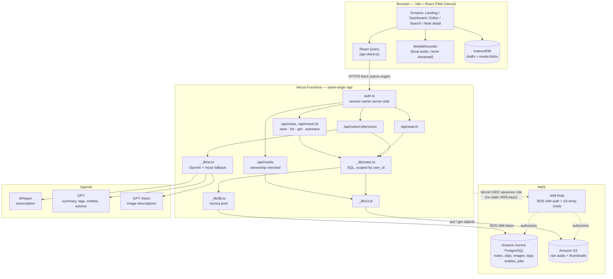

# Mnemo Architecture

## System overview



## Capture → persist → AI → retrieve

```mermaid
sequenceDiagram
  autonumber
  actor U as User
  participant FE as React PWA
  participant IDB as IndexedDB
  participant API as Vercel Functions
  participant DB as Aurora PostgreSQL
  participant S3 as Amazon S3
  participant AI as OpenAI

  U->>FE: Write note, record audio, attach image
  FE->>IDB: Save draft + blobs (every change)
  Note over FE,IDB: Survives abrupt close; recovers on next open

  U->>FE: Done / Save
  FE->>API: POST /api/notes (text + media as data URLs)
  API->>API: authenticate() resolves owner
  API->>S3: Upload audio + image bytes
  API->>DB: Insert note + media metadata (status=queued)
  API-->>FE: Saved note
  FE->>IDB: Clear synced draft

  FE->>API: POST /api/notes/:id/process
  API->>S3: Read audio / image bytes
  API->>AI: Whisper transcribe + GPT analyze + vision describe
  AI-->>API: transcript, summary, tags, entities, captions
  API->>DB: Persist AI output (status=indexed)
  Note over API,AI: If any AI call fails, fall back to mock; note still indexes

  U->>FE: Search "by meaning"
  FE->>API: GET /api/search?q=...
  API->>DB: Match title, body, summary, tags,<br/>transcripts, captions, entities
  DB-->>API: Ranked notes
  API-->>FE: Results + match reasons
```

## Notes

- The browser never holds AWS or OpenAI credentials; it only calls same-origin
  `/api/*`. All privileged access lives in Vercel Functions.
- AWS access is keyless: Vercel OIDC assumes an IAM role for RDS IAM database
  auth and temporary S3 credentials.
- Media is private: S3 objects are served back only through `/api/media`, which
  verifies the note belongs to the requesting owner.
- Ownership is resolved server-side (`auth.ts`). The MVP scopes all data to a
  single seeded demo user; real per-user auth plugs into the same function.
- The AI pipeline degrades gracefully: if OpenAI fails, deterministic mock logic
  keeps the note flowing to `indexed`.
